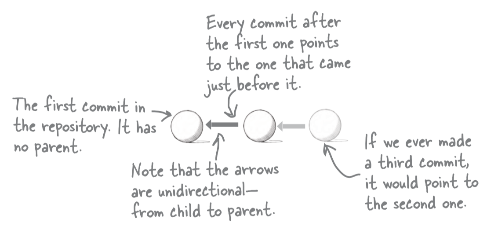

# Chapter 1: Beginning Git

## Why do we need Version Control?
There are 3 main benefits of using version control like git
1. **Retain history of changes** We can save our progress in the form of snapshots
2. **Safety net** We can revert back to previous snapshots if we make a mistake
3. **Teamwork** Git allows us to collaborate with others

#### My personal advantages
1. heatmap of commits to keep me motivated
2. Access of my code from multiple devices

## Getting Started with git
To start working with git you need to convert your project into a git repo, to do that, run the `git init` command at the top level of your project.

### Command line basics
- `pwd` **print working directory** tells you where you are in the file system
- `mkdir FOLDER-NAME` **make directory** creates a folder
- `ls` **list directory** outputs the files and folder in the current directory.
    - `-A` flag used to outputs **All**  files including **hidden** files

    
## Configuring name and email
- `git config --global user.name "Junaid Mughal"`
- `git config --global user.email "junaidgohan123@gmail.com"`

## Commit Basics
Committing our work requires two steps
- Adding our work `git add FILE-NAME`
- Committing our work `git commit -m "Your Message"`

To remove a file from index you can use `git reset FILE-NAME` or `git reset` to empty the index

## The three stages of git
- working directory
- index also called staging area
- object database where all commits are stored

index is used to house our changes temporarily before they are committed to the object database

file that has never been added to the index is marked as 'untracked' 

file that has added to index is marked as tracked and
after commit it is marked as unmodified

## git status
`git status` this command tells which files are untracked, modified and are in staging area
- to shorten the output, you can provide `-s` flag

## Commit history
Every commit has an unique commit id, every commit also stores the commit id of the previous commit (except the first commit). 
Following parent from current commit is what creates a `commit history`

